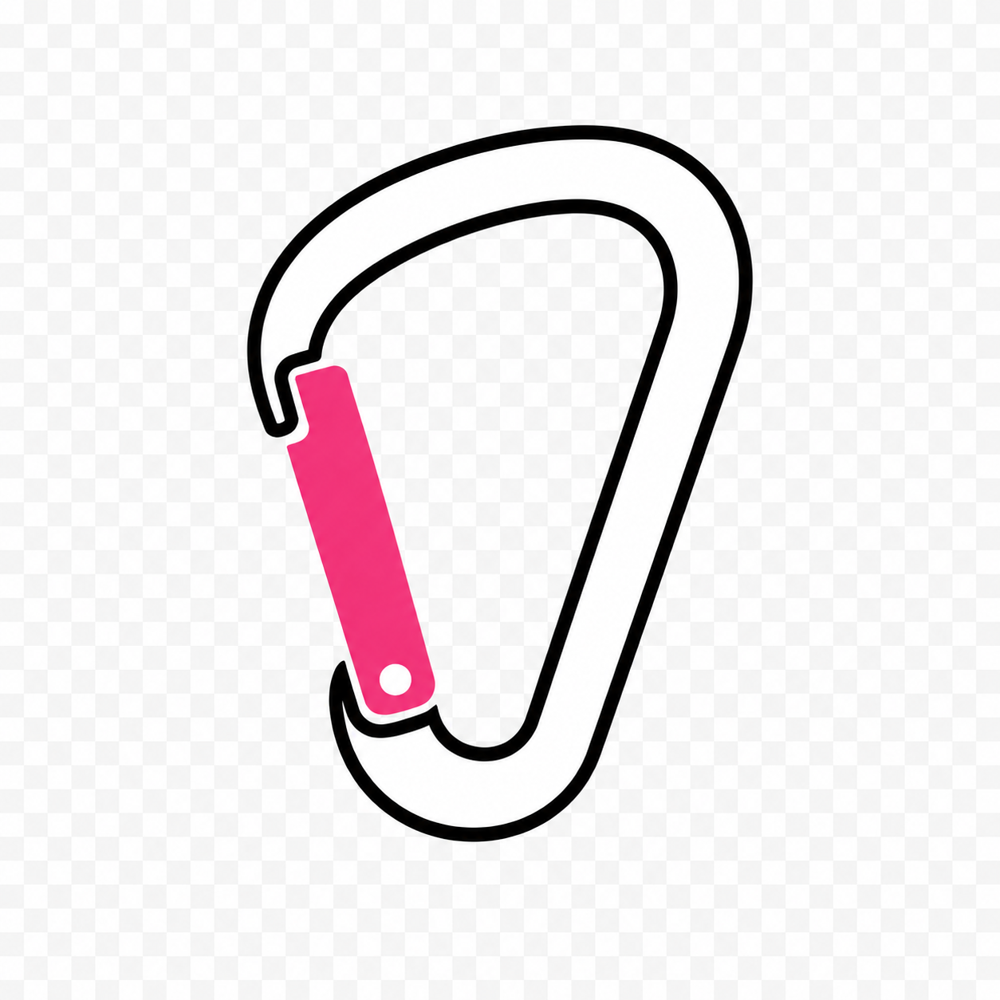

# belay

`belay` is a small CLI for creating opinionated project folders and repos.



## Python Projects

```sh
belay py something
```

This creates `./something` as a uv-compatible Python package with:

- `pyproject.toml`
- `src/<module>/`
- `tests/`
- `.python-version`
- `uv.lock`
- `.git/` with initial branch `main`
- `ruff`, `ty`, and `pytest` added through `uv add --dev`
- `py.typed` for typed package distribution

Belay shells out to uv for the project setup:

```sh
uv init --lib --python <version> --name <name> --no-description --author-from none --vcs none --no-workspace <path>
uv add --dev ruff ty pytest
```

The default Python target is `3.13`:

```sh
belay py something --python 3.14
```

## Rust CLI Projects

```sh
belay rs-cli something
```

This creates `./something` as a polished Rust CLI with:

- `Cargo.toml`
- `src/main.rs`
- `src/lib.rs`
- `tests/smoke.rs`
- `.git/` with initial branch `main`
- `clap` with styled help output
- `color-eyre` for ergonomic error reporting

## Go CLI Projects

```sh
belay go-cli something
```

This creates `./something` as a polished Go CLI with:

- `go.mod`
- `main.go`
- `cmd/root.go`
- `cmd/root_test.go`
- `.git/` with initial branch `main`
- `cobra` for command structure and help output

Belay owns repository initialization and runs:

```sh
git init -b main
```

This keeps the initial branch policy independent of scaffold tool defaults.

## Shell Integration

A binary cannot directly change its parent shell's current directory. `belay`
solves that by installing a shell function that delegates project creation to
the Rust binary, captures the new directory, and then runs `cd` in the shell.

```sh
belay shell install fish
belay shell install bash
belay shell install zsh
```

After restarting or sourcing the shell config:

```sh
belay py something
belay rs-cli cli-demo
belay go-cli go-demo
pwd
```

## Appearance

In an interactive terminal, `belay` queries the configured background color and
uses pink accents with white text on dark backgrounds, or purple accents with
black text on light backgrounds. If the terminal does not report a background
color, the dark theme is used.
The block `BELAY` banner keeps a pink-to-purple-to-blue cascade with shades
selected for contrast against the detected background.

Set `BELAY_BACKGROUND=dark` or `BELAY_BACKGROUND=light` to override detection.
Set `NO_COLOR=1` to disable styled output.
